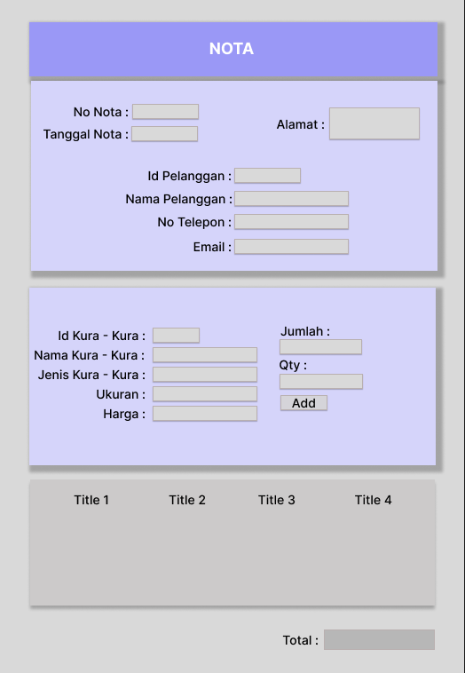

# Java OOP POS – Point of Sale Application

## 📌 Deskripsi
Project ini merupakan **Ujian Akhir Semester (UAS) mata kuliah Implementasi Pemrograman Berorientasi Objek (IPBO)**.  
Aplikasi dibangun menggunakan **Java OOP** untuk mengelola sistem penjualan sederhana (Point of Sale) yang mencakup **pelanggan, produk, pesanan, dan nota transaksi**.

## ⚙️ Fitur Utama
- **Manajemen Pelanggan** → tambah, ubah, hapus, dan lihat data pelanggan  
- **Manajemen Produk** → tambah, ubah, hapus, dan lihat data produk  
- **Transaksi Pesanan** → mencatat detail pesanan pelanggan  
- **Nota Transaksi** → mencetak nota / invoice pesanan  
- **Database Integration** → menggunakan MySQL untuk penyimpanan data  

## 🗂 Struktur Project
java-oop-pos/
├── Database/ # File SQL untuk setup database
│ └── db_uas.sql
├── turtle0943/ # Source code utama
│ ├── src/
│ │ ├── ctr/ # Controller (logika aplikasi)
│ │ ├── database/ # Koneksi ke database
│ │ ├── ent/ # Entity (class model data)
│ │ ├── frm/ # Form (UI Java Swing)
│ │ └── report/ # Report generator
│ └── Turtle0943.java # Main class aplikasi
└── README.md

## 🛠 Teknologi yang Digunakan
- **Java** (OOP, Swing GUI)
- **MySQL** (Database)
- **NetBeans IDE** (Development)
- **JasperReports** (Laporan / Nota)

## 🚀 Cara Menjalankan
1. Import file database `Database/db_uas.sql` ke MySQL  
2. Buka project di **NetBeans / IntelliJ**  
3. Jalankan `Turtle0943.java` sebagai main program  
4. Login dan mulai gunakan aplikasi  

## 📸 UI

## 👨‍💻 Kontributor
- **Dodi Prayoga** – Universitas Budi Luhur  

---
